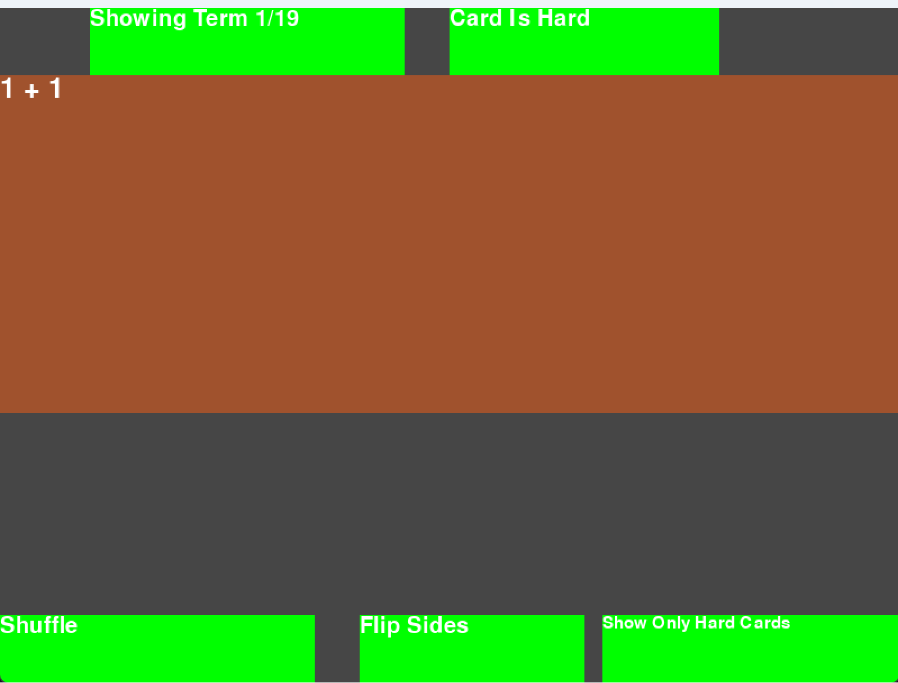

Finished Development: 05/02/2022

# Summary
This was an application I made that was an alternative to Quizlet. The application could be used offline and I thought 
that it was quicker to use than Quizlet. I also had full control over all the features. The user could modify the application 
by typing in the terms in a text file. Text files are quicker to modify than GUI's generally, which is why I had it set 
up that way. Another reason I made the application was because my history teacher, Ms. Herring, had us type out the study 
guide. Since there were at least 100 terms, I did not want to have to retype those terms into a flashcard application like 
Quizlet. I decided that I could write a simple script to turn the typed study guide into a term and definition text file. 
Then I could write my own simple Flash Cards application. Therefore, I could instantly create flash cards for the typed 
study guide. I also used this application to study for many other tests (AP Biology, an econ test, etc.). The application 
would also save all the flash cards that the user said were 'hard' to a text file. This meant that the user could continue 
to study those terms after they were done with the current session.

# Using the Application
The user can press the left and right arrow keys to go between terms. Clicking the 'h' key or clicking the 'Card is Hard' 
button will toggle whether the current card is 'hard.' Pressing the 'space bar' or clicking the card will flip the current card over.
Everything else should behave as expected, but for the sake of clarity, I will explain the rest of the buttons. The 'Shuffle'
button will shuffle the cards. The 'Flip Sides' button will toggle between showing the term and the definition first. The 
'Show Only Hard Cards' button will toggle between showing all the cards and only the cards that the user said were 'hard.'

# Application Image

# How to Run
- Download pygame with 'pip install pygame'
- Run the 'main.py' file from the root directory of this project

# Modifications 12/21/2023
- Put all the python files into modules to make the code more readable (originally all files were in the root directory)